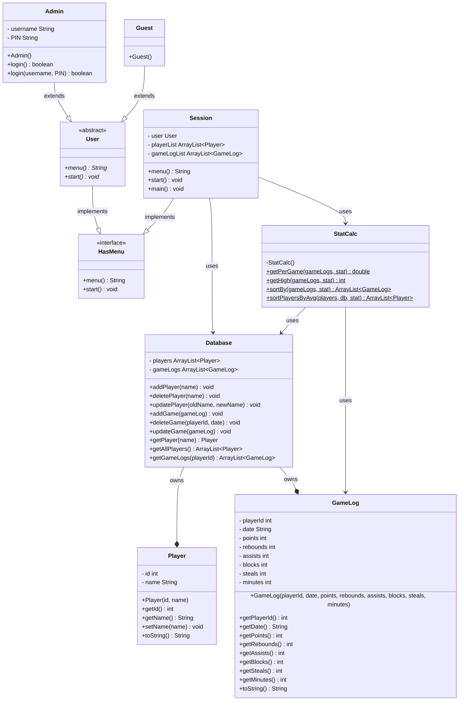

# cs121finalProject
Basketball Player Database Project

```mermaid
classDiagram

class HasMenu{
    <<interface>>
    +menu() String
    +start() void
}

class Database{
    - players ArrayList~Player~
    - gameLogs ArrayList~GameLog~
    +addPlayer(name) void
    +deletePlayer(name) void
    +updatePlayer(oldName, newName) void
    +addGame(gameLog) void
    +deleteGame(playerId, date) void
    +updateGame(gameLog) void
    +getPlayer(name) Player
    +getAllPlayers() ArrayList~Player~
    +getGameLogs(playerId) ArrayList~GameLog~
}

class GameLog{
    - playerId int
    - date String
    - points int
    - rebounds int
    - assists int
    - blocks int
    - steals int
    - minutes int
    +GameLog(playerId, date, points, rebounds, assists, blocks, steals, minutes)
    +getPlayerId() int
    +getDate() String
    +getPoints() int
    +getRebounds() int
    +getAssists() int
    +getBlocks() int
    +getSteals() int
    +getMinutes() int
    +toString() String
}

class Player{
    - id int
    - name String
    +Player(id, name)
    +getId() int
    +getName() String
    +setName(name) void
    +toString() String
}

class StatCalc {
    -StatCalc()
    +getPerGame(gameLogs, stat) double$
    +getHigh(gameLogs, stat) int$
    +sortBy(gameLogs, stat) ArrayList~GameLog~$
    +sortPlayersByAvg(players, db, stat) ArrayList~Player~$
}

class User{
    <<abstract>>
    +menu()* String
    +start()* void
}

class Admin{
    - username String
    - PIN String
    +Admin()
    +login() boolean
    +login(username, PIN) boolean
}

class Guest{
    +Guest()
}

class Session{
    - user User
    - playerList ArrayList~Player~
    - gameLogList ArrayList~GameLog~
    +menu() String
    +start() void
    +main() void
}

Admin --|> User : extends
Guest --|> User : extends
User --|> HasMenu : implements
Session --|> HasMenu : implements
Session --> Database : uses
Session --> StatCalc : uses
Database --* Player : owns
Database --* GameLog : owns
StatCalc --> GameLog : uses
StatCalc --> Database : uses
```
