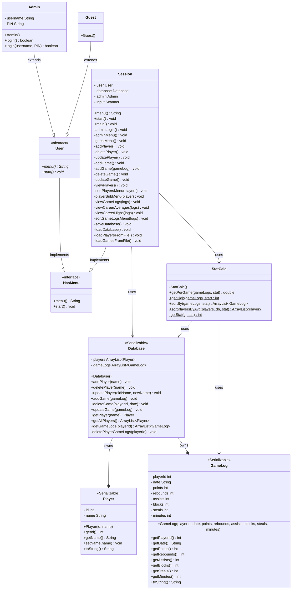

# cs121finalProject
Basketball Player Database Project

This project functions as a simple database for basketball statistics, allowing for users to view data in different forms or add/manipulate the data.
Users can login as guest without any credentials and have access to view the data, but to edit the database the user must login as an Admin
A simple usecase could be a small Highschool Basketball team doing statkeeping for their team's players

### Admin Login Credentials
username: admin
password: 1111

The program will save any changes made to the database in the 'database.dat' file and then load it when the program is started to allow for persistance between sessions.
Users can view an individual players stats in a variety of manners, or sort a list of all players by their average stats.

## Class Explanations
### GameLog.java
The GameLog objects are the core building block of the program. Each GameLog contains a statline from an individual game of a single player, tied to the player via the playerId variable.
Each statistic is saved as a variable via the constructor and has a corresponding getter method.
Contains an overridden toString() method that allows for simpler printing of the statline

### Player.java
The second building block of the program, the Player class's key feature is the playerId variable that allows for GameLogs to be tied to the correct player.
Both name and id variables have getter methods and name has a setter method in case the admin needs to adjust a name (id shouldn't be changed as that would mess up the data structure)
Contains a similar toString() method as in GameLog.java for similar purposes

### Database.java
Database.java holds all of the Player and GameLog objects in two separate ArrayLists and contains the methods needed to manage them
addPlayer(), deletePlayer(), and updatePlayer() are all self explanatory, where addPlayer atomatically assigns the Player a playerId based on the current length of the players ArrayList
updatePlayer() keeps playerId the same between the old and new names so its ideal for something like a typo in data entry where the GameLogs should still stay attatched to the Player object
deletePlayer() also calls the deletePlayerGameLogs() method which allows it to automatically remove and GameLogs that contain the playerId of the player being deleted
addGame(), deleteGame(), and updateGame() are also self explanitory, interacting directly with the gameLogs ArrayList
updateGame() functions by iterating through the array and checking against playerId and date variables, with the assumption that only 1 game per day is possible. 
Additionally this means if a date is intered wrong the GameLog needs to be deleted and re-added
getGameLogs() retrieves every GameLog of a given player from the ArrayList and returns a new ArrayList with just those GameLogs

### StatCalc.java
StatCalc.java holds the methods that allow for data manipulation and visualization
getStat() takes user input (given in Session.java) to decide which GameLog getter method to call and retrieve the correct variable the from the GameLog object
This approach allows for much fewer methods needed to actually compute every statistic (as opposed to a getPointsPerGame(), getReboundsPerGame() etc approach)
getPerGame() returns the average per-game value of a players given statistic
getHigh() returns the highest value a player has achieved in a given statistic
sortBy() and sortPlayersByAvg() return new ArrayLists containing a given players GameLogs sorted by the given statistic (sortBy) or all players sorted by their averages in a given statistic (sortPlayersByAvg)
Both make use of a bubble sort

### HasMenu.java
Interface that specifies the menu() and start() classes

### User.java
Abstract class that is used by Session.java() to treat Admin() and Guest() interchangibly in certain spots

### Guest.java
Guest class is pretty bare bones, only really containing the initial guest menu. Guest users should be able to make use of certain functionalities but not others, so this menu only gives them access to what is needed.

### Admin.java
Admin class is a user that has more permissions than the Guest, shown by the additional options in its menu method.
Contains an overloaded login() method in case the program moved past the hard coded login credentials and allows for easier testing/different implementation
the menu methods for both User classes return strings and have no interactivity with the user, keeping all UI contained in the Session class

### Session.java
Session is the main hub of the program, containing all the methods that interact with the user and using Database.java and StatCalc.java in particular.
Additionally Session.java is where the program interacts with other files as well as saving the database between uses
Session.menu() starts with a buffer menu prompting the user to proceed as either an Admin or Guest
Session.start() prints the menu and is where the actual user interaction starts, moving on to the subsequent menus
All methods from lines 57 to 413 are UI methods printing options for the user and calling on methods from StatCalc, Database, Player, and GameLog
Thsee are all self explainatory are generally named in tandem with the other class' methods they call upon
They mostly follow the same logic featuring switch and if-else statments to move through options and user responses
viewGameLogs(), viewCareerAvgs(), viewCareerHighs(), and sortGameLogsMenu() all display stats based on the user input (though only sortGameLogsMenu() takes user input among these)
These could be considered the endpoint of the "nested" menus
SaveDatabase() and LoadDatabase() save and load the database object to the "database.dat" file to allow for persistence between sessions.
LoadDatabase is called once in the session constructor, while SaveDatabase is called whenever a user exists the program
LoadPlayerFromFile() LoadGamesFromFile() both read correctly formatted csv files and append the data to the respective ArrayList
these methods are currently not in use (commented out in the Session constructor) but were initially used to load "players.csv" and "games.csv" into the database to allow for easy testing
These methods could be used later to allow for a User to upload more data through a file in addition to manually adding gamelogs through the program if the program were to be expanded

### UML Diagram

